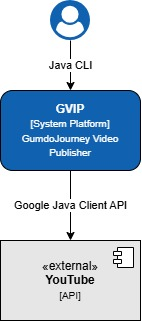
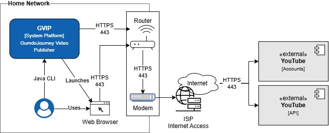

# GVIP Architecture Documentation


## 1 - Introduction and Goals

GVIP (GumdoJourney Video Publisher) is a standalone Java command-line application that runs on a Windows computer.

Its purpose is to manage local video files and automate the publication of new videos to YouTube. GVIP parses each video filename according to one of six supported filename formats and uses the parsed information to construct the YouTube video properties.


### 1.1 Requirements overview

GVIP will:

* Traverse configured directories looking for `.mp4` files.
* Resolve Windows `.lnk` shortcut files to locate additional directories.
* Track which video files have already been uploaded.
* Recognize six supported video filename formats.
* Extract YouTube video properties from the file names.
  
  * title
  * description
  * recording date
  * audience setting
  * playlist assignments
  * video language
  * title and description language
  * tags

* Upload new videos to YouTube.
* Assign uploaded videos to one or more YouTube playlists.


### 1.2 Quality goals

These are the important quality goals. See [ISO 25010](https://iso25000.com/index.php/en/iso-25000-standards/iso-25010) for more details.

**Functional Stability**
* _Functional completeness_. The different file formats must be processed and uploaded to YouTube once and only once.  
* _Functional correctness_. The names of the files must be parsed correctly extract all of the YouTube video properties which must be set.
* _Functional appropriateness_. Users can complete the entire video publishing process (upload, metadata, playlist assignment, and scheduling) without using YouTube Studio.

**Compatibility**
* _Co-Existence_. Do not abuse the YouTube API; use the API nicely. The automation should not flood (denial of service) the API with requests too quickly. This may possibly causing a lock-out or ban to the channel.

**Security**
* _Confidentiality_. YouTube API credentials and data storage must be kept secure and local. Do not publish to source control. 

**Maintainability**
*  _Modularity_. Organize the source code into distinct modules, each with it own distinct responsiblity. All the modules working together will provide the full solution. 
*  _Modifiability_. The source code must be readable and easy to modify.
*  _Testability_. The source code must be easy to test, verifying each distinct module is functioning correctly (_functional correctness_).

**Flexibility**
* _Installability_. The application should be easy to assemble together and execute with little to no additional infrastructure needed...a binary distribution. 


### 1.3 Stakeholders

The primary stakeholder is the application owner who will serve all roles and will use GVIP for personal management and publication of videos to the GumdoJourney YouTube channel.


## 2\. Constraints

### 2.1 Software Development Policy

REFERENCE&nbsp;&nbsp;&nbsp;Enterprise Architecture Office, _Software Development Policy_

* _Java_: The application will be implemented in Java.
* _Maven_: Dependency management, building, testing, and packaging will be handled by Apache Maven.


### 2.5 Software Security Policy

REFERENCE&nbsp;&nbsp;&nbsp;Enterprise Architecture Office, Software Security Policy.

* API Authentication configuration must be 
  * encrypted
  * not hard-coded in code
  * not stored in source control
  * not written to logs


## 3\. Context

### 3.1 Business context




| Partner Organization | Partner System | Data Shared | Data Format | Interface Direction | Transfer Direction | Execution Mode | Implementation |
| ---- | ---- | ---- | ---- | ---- | ---- | ---- | ---- |
| Google | YouTube | Video binary with its metadata | JSON, <br /> Binary | Outbound | Push | On-demand | Google Java Client API |


### 3.2 Technical context


| Source |  | Target |  |  |  |
| ---- | ---- | ---- | ---- | ---- | ---- |
| **Component** | **Domain / IP**| **Component** | **Domain / IP** | **Port** | **Protocol** |
| Web browser | 192.168.1.5 | Router | 192.168.1.1 | 443 | HTTPS |
| GVIP | 192.168.1.5 | Router | 192.168.1.1 | 443 | HTTPS |
| Router | 192.168.1.1 | Modem | Layer 2 forwarding | --- | --- |
| Modem | 71.10.191.124 | Google | accounts.google.com | 443 | HTTPS |
| Modem | 71.10.191.124 | Google | www.googleapis.com | 443 | HTTPS |


## 4\. Solution Strategy

### 2.2 Interface Constraints

* GVIP will provide a command-line interface.
* No graphical user interface is required.

### 2.3 Operating System Constraints

* GVIP will run on Windows.
* Windows PowerShell will be used to inspect `.lnk` files and resolve their target directories.

### 2.4 Data Storage Constraints

* Upload state will be stored in a simple local data file.
* YAML must not be used.
* The final format may be JSON, CSV, or another suitable non-YAML format.
  
### 2.6 YouTube Integration Constraints

* GVIP will communicate with YouTube through the YouTube API.
* A suitable third-party Java library may be used.
* If no suitable library meets the requirements, GVIP will make the API calls directly.
* YouTube integration should be isolated behind an application interface so that the implementation can be changed later.

### 2.7 Filename Processing Constraints

* Only `.mp4` files are currently supported.
* The filename is the primary source of video metadata.
* The complete original filename will be used as the YouTube description.
* Korean characters in filenames must be preserved.
* GVIP must recognize the six supported filename formats described in section 8.

### 4.1 Overall Approach

GVIP will be implemented as a local, single-user Java CLI application.

The primary workflow is:

1. Load configuration and credentials.
2. Traverse configured directories.
3. Resolve Windows shortcut files.
4. Locate `.mp4` files.
5. Skip files already recorded as uploaded.
6. Detect the filename format.
7. Parse the filename into structured metadata.
8. Construct the YouTube upload properties.
9. Upload the video.
10. Assign the video to the appropriate playlists.
11. Record the successful upload.
12. Report the result to the user.

### 4.2 Architectural Style

GVIP will use a modular standalone architecture with separate components for:

* CLI interaction,
* configuration,
* filesystem traversal,
* shortcut resolution,
* filename format detection,
* filename parsing,
* metadata construction,
* playlist resolution,
* state persistence,
* YouTube API communication,
* workflow orchestration.

### 4.3 Metadata Strategy

Filename parsing is a core application capability.

Each supported filename format will have a corresponding parser rule. The parser will return a structured metadata object containing:

* video title,
* complete original filename,
* recording date,
* primary playlist,
* optional playlists,
* tags,
* audience setting,
* detected filename format.

The metadata builder will convert this object into the properties required by the YouTube API.

\---

## 5\. Building Block View

### 5.1 Main Building Blocks

#### CLI Entry Point

Starts GVIP, reads command-line arguments, invokes the processing workflow, and displays results.

#### Configuration Component

Loads settings and credentials from one or more properties files.

#### File Discovery Component

Traverses configured directories and identifies:

* `.mp4` video files,
* `.lnk` shortcut files.

#### Windows Shortcut Resolver

Uses PowerShell to obtain the target directory of a `.lnk` file.

#### Upload State Store

Reads and writes the local non-YAML upload state file.

#### Filename Format Detector

Determines which of the six supported filename formats matches a video filename.

#### Filename Parser

Extracts metadata from a filename according to the detected format.

#### Metadata Builder

Creates YouTube upload metadata, including:

* title,
* description,
* recording date,
* tags,
* audience setting.

#### Playlist Resolver

Determines playlist names or IDs from the parsed filename information.

#### YouTube Integration Component

Authenticates with YouTube, uploads videos, and assigns playlists.

#### Application Orchestrator

Coordinates the complete processing workflow.

### 5.2 Component Relationships

1. The CLI Entry Point starts GVIP.
2. The Configuration Component loads configuration and credentials.
3. The File Discovery Component finds `.mp4` and `.lnk` files.
4. The Windows Shortcut Resolver resolves `.lnk` targets.
5. The Upload State Store identifies previously uploaded files.
6. The Filename Format Detector identifies the format of each new file.
7. The Filename Parser extracts structured metadata.
8. The Playlist Resolver determines playlist assignments.
9. The Metadata Builder creates the YouTube metadata.
10. The YouTube Integration Component uploads the video.
11. The YouTube Integration Component assigns playlists.
12. The Upload State Store records the successful upload.
13. The CLI displays the processing result.

\---

## 6\. Runtime View

### 6.1 Main Processing Scenario

1. The user runs GVIP from the command line.
2. GVIP loads the application properties file.
3. GVIP loads YouTube credentials and authentication configuration.
4. GVIP scans the configured directory tree.
5. GVIP resolves discovered `.lnk` files using PowerShell.
6. GVIP finds `.mp4` files in the configured and resolved directories.
7. GVIP compares each file with the upload state file.
8. GVIP skips files already recorded as successfully uploaded.
9. GVIP detects the filename format for each new file.
10. GVIP parses the filename.
11. GVIP extracts the title, description, recording date, playlists, tags, and audience setting.
12. GVIP constructs the YouTube upload request.
13. GVIP uploads the video.
14. GVIP assigns the video to the resolved playlists.
15. GVIP records the successful upload.
16. GVIP reports the result to the user.

### 6.2 Filename Parsing Scenario

For every new `.mp4` file:

1. Receive the complete filename.
2. Preserve the original filename for the YouTube description.
3. Remove the `.mp4` extension for format matching.
4. Detect one of the six supported formats.
5. Extract the date from the `YYYY-MM-DD` portion.
6. Extract format-specific title and playlist values.
7. Add the standard tags.
8. Set the audience to not made for kids.
9. Add the `Commentary` playlist when required.
10. Return a structured metadata object.

### 6.3 Unsupported Filename Scenario

If a filename does not match one of the six supported formats:

* GVIP will not upload the file.
* The filename and reason will be reported.
* The error will be logged.
* Processing may continue with other files.

### 6.4 Upload Failure Scenario

If an upload fails:

* The error will be displayed and logged.
* The file will not be marked as successfully uploaded.
* The file will remain eligible for a future retry.

\---

## 7\. Deployment View

### 7.1 Deployment Model

GVIP will be deployed as a local Java application on a Windows computer.

### 7.2 Runtime Environment

The runtime environment includes:

* Windows operating system,
* Java runtime,
* Maven-built application artifact,
* local video directories,
* Windows PowerShell,
* properties file,
* upload state file,
* internet connectivity,
* YouTube API access.

### 7.3 Example Deployment Layout

```text
GVIP/
├── gvip.jar
├── config/
│   ├── gv ip.properties
│   └── youtube-credentials.properties
├── data/
│   └── upload-state.json
└── logs/
    └── gv ip.log
```

The actual filenames and directory names remain to be finalized.

\---

## 8\. Crosscutting Concepts

### 8.1 Common YouTube Properties

All six filename formats use the following common rules.

#### Description

The complete original filename is used as the YouTube description.

The description must preserve:

* the file extension,
* punctuation,
* spaces,
* English text,
* Korean characters.

#### Audience

Every video is marked as **not made for kids**.

#### Tags

The following hard-coded tags are applied to every video:

```text
haidong gumdo
해동검도
korean
sword
검
ssangsu gumbup
쌍수검법
gyuk gum
격검
paper cutting
jong-i-pegi
종이 베기
apple cutting
sagwa-pegi
사과베기
candle snuffing
chotbul-kkeugi
촛불끄기
```

#### Recording Date

The recording date is extracted from the `YYYY-MM-DD` portion of the filename.

The title uses the year and month in `YYYY-MM` format.

#### Language

For every video, set the "Title and description language" as English (United States) **en-US**.

For every video, set the "Video language" as English (United States) **en-US**.


### 8.2 Filename Format 1: Color Belt Self-Defense Form

#### Example

```text
Color belt 1st self-defense form \[유급자 첫번째 격검] commentary - Haidong Gumdo (2022-08-13 05.28).mp4
```

#### Extracted Properties

**Title:**

```text
Color 1st Self-Defense (2022-08) Commentary - Haidong Gumdo
```

**Description:**

The complete original filename without the .mp4 extension.

**Primary playlist:**

```text
Color 1st Self-Defense
```

**Additional playlist:**

```text
Commentary
```

The additional playlist is assigned because the filename contains `commentary`.

**Recording date:**

```text
2022-08-13
```

#### Parsing Rules

* Recognize the `Color belt` prefix.
* Extract the ordinal value, such as `1st`.
* Include the ordinal value in the title and playlist.
* Convert `self-defense` to `Self-Defense`.
* Detect `commentary` case-insensitively.
* Include `Commentary` in the title when present.
* Extract the date from the final date/time segment.
* Ignore the time portion for the recording date.

### 8.3 Filename Format 2: Black Belt Dan Self-Defense Form

#### Example

```text
Black belt 1st Dan 2nd self-defense form \[유단자 1단 두번째 격검] commentary - Haidong Gumdo (2026-04-05 14.15).mp4
```

#### Extracted Properties

**Title:**

```text
1st Dan 2nd Self-Defense (2026-04) Commentary - Haidong Gumdo
```

**Description:**

The complete original filename without the .mp4 extension.

**Primary playlist:**

```text
1st Dan 2nd Self-Defense
```

**Additional playlist:**

```text
Commentary
```

**Recording date:**

```text
2026-04-05
```

#### Parsing Rules

* Recognize the `Black belt` prefix.
* Extract the Dan value, such as `1st Dan`.
* Extract the self-defense form number, such as `2nd`.
* Include both values in the title and playlist.
* Convert `self-defense` to `Self-Defense`.
* Detect `commentary` case-insensitively.
* Include `Commentary` in the title when present.
* Extract the date from the final date/time segment.

### 8.4 Filename Format 3: Personal Self-Defense Form

#### Example

```text
Personal 1st self-defense form \[개인 첫번째 격검] commentary - Haidong Gumdo (2026-07-09 05.27).mp4
```

#### Extracted Properties

**Title:**

```text
Personal 1st Self-Defense (2026-07) Commentary - Haidong Gumdo
```

**Description:**

The complete original filename without the .mp4 extension.

**Primary playlist:**

```text
Personal 1st Self-Defense
```

**Additional playlist:**

```text
Commentary
```

**Recording date:**

```text
2026-07-09
```

#### Parsing Rules

* Recognize the `Personal` prefix.
* Extract the ordinal value, such as `1st`.
* Include the ordinal value in the title and playlist.
* Convert `self-defense` to `Self-Defense`.
* Detect `commentary` case-insensitively.
* Include `Commentary` in the title when present.
* Extract the date from the final date/time segment.

### 8.5 Filename Format 4: Two-Handed Sword Form

#### Example

```text
Two-handed sword form #11 \[쌍수검법 11번] commentary - Haidong Gumdo (2025-11-25 05.18).mp4
```

#### Extracted Properties

**Title:**

```text
Two-Handed #11 Sword Form (2025-11) Commentary - Haidong Gumdo
```

**Description:**

The complete original filename without the .mp4 extenstion.

**Primary playlist:**

```text
Two-Handed #11 Sword Form
```

**Additional playlist:**

```text
Commentary
```

**Recording date:**

```text
2025-11-25
```

#### Parsing Rules

* Recognize the `Two-handed sword form` prefix.
* Extract the form number, such as `#11`.
* Normalize `Two-handed` to `Two-Handed`.
* Normalize `sword` to `Sword`.
* Normalize `form` to `Form`.
* Use the form number in the title.
* Use the form number in the primary playlist.
* Detect `commentary` case-insensitively.
* Include `Commentary` in the title when present.
* Extract the date from the final date/time segment.

### 8.6 Filename Format 5: Basic Movement

#### Example

```text
Basic movement \[기본동작] commentary - Haidong Gumdo (2023-07-20 06.08).mp4
```

#### Extracted Properties

**Title based on the filename:**

```text
Basic Movement (2023-07) Commentary - Haidong Gumdo
```

**Description:**

The complete original filename without the .mp4 extension.

**Primary playlist:**

```text
Basic Movement
```

**Additional playlist:**

```text
Commentary
```

**Recording date:**

```text
2023-07-20
```

#### Parsing Rules

* Recognize the `Basic movement` prefix.
* Normalize it to `Basic Movement`.
* Assign the `Basic Movement` playlist.
* Detect `commentary` case-insensitively.
* Include `Commentary` in the title when present.
* Extract the date from the final date/time segment.

### 8.7 Filename Format 6: Belt Test Montage

#### Example

```text
Sword test montage - Haidong Gumdo Red-Blue belt test - Master Lim's Martial Arts, Fairview Heights, IL - Michael (2023-07-12 19.46).mp4
```

#### Extracted Properties

**Title:**

```text
Red-Blue Belt Test (2023-07) - Haidong Gumdo
```

**Description:**

The complete original filename without the .mp4 extension

**Primary playlist:**

```text
Belt Tests
```

**Recording date based on the filename:**

```text
2023-07-12
```

#### Parsing Rules

* Recognize the `Sword test montage` prefix.
* Locate the `Haidong Gumdo` segment.
* Extract the belt designation following that segment.
* Extract the test type.
* Normalize the extracted value to `Red-Blue Belt Test`.
* Assign the video to the `Belt Tests` playlist.
* Extract the date from the final date/time segment.
* Do not assign the `Commentary` playlist unless the final rule explicitly adds it.


### 8.8 Playlist Assignment

Each filename format determines a primary playlist.

Examples:

|Filename format|Primary playlist|
|-|-|
|Color belt self-defense|`Color 1st Self-Defense`|
|Black belt Dan self-defense|`1st Dan 2nd Self-Defense`|
|Personal self-defense|`Personal 1st Self-Defense`|
|Two-handed sword form|`Two-Handed #11 Sword Form`|
|Basic movement|`Basic Movement`|
|Belt test montage|`Belt Tests`|

When `commentary` is present in a filename, the video is also assigned to:

```text
Commentary
```

The implementation must resolve playlist names to YouTube playlist IDs before assigning a video.

### 8.9 Windows Shortcut Resolution

GVIP may encounter `.lnk` files that point to directories containing video files.

The process is:

1. Find `.lnk` files during directory traversal.
2. Invoke Windows PowerShell.
3. Extract the target path.
4. Verify that the target exists and is a directory.
5. Traverse the target directory.
6. Avoid processing duplicate target directories.
7. Report unresolved or invalid shortcuts.

PowerShell invocation must be isolated from the rest of the application and handled safely.

### 8.10 Logging

GVIP should log or display:

* directories scanned,
* shortcuts found,
* shortcut targets resolved,
* `.mp4` files discovered,
* detected filename formats,
* parsed metadata,
* selected playlists,
* skipped files,
* successful uploads,
* YouTube video IDs,
* parsing errors,
* upload failures,
* state-file updates.

\---

## 9\. Architecture Decisions

### 9.1 Java and Maven

**Decision:** Implement GVIP in Java using Maven.

**Rationale:**

* Java is appropriate for a standalone CLI application.
* Maven provides dependency management and build support.
* Java supports available YouTube API libraries and HTTP clients.

### 9.2 CLI Interface

**Decision:** Use a CLI rather than a GUI.

**Rationale:**

* The application is intended for personal use.
* The required workflow does not require a GUI.
* A CLI reduces development complexity.
* The application can later be used by scripts or scheduled tasks.

### 9.3 Local State File

**Decision:** Store upload state in a simple non-YAML data file.

**Rationale:**

* A database is unnecessary for the initial scope.
* A local file is easy to back up and inspect.
* The solution remains lightweight.

### 9.4 Properties File for Credentials

**Decision:** Load API credentials and authentication settings from a properties file.

**Rationale:**

* Prevents credentials from being hard-coded.
* Allows configuration changes without recompiling.
* Separates sensitive information from application logic.

### 9.5 Filename-Based Metadata Derivation

**Decision:** Use filename parsing as the primary mechanism for constructing YouTube metadata.

**Rationale:**

* The filename contains the information needed for publication.
* Manual metadata entry is unnecessary.
* The process is repeatable and automatable.
* Each format can be independently tested.

### 9.6 Six Explicit Filename Formats

**Decision:** Initially support six explicitly defined filename formats.

**Rationale:**

* The formats represent the existing naming conventions.
* Explicit rules are safer than parsing arbitrary filenames.
* Additional formats can be added as separate parser implementations.

### 9.7 Original Filename as Description

**Decision:** Use the complete original filename as the YouTube description.

**Rationale:**

* Preserves all original information.
* Preserves Korean characters.
* Maintains a direct relationship between the local file and the published video.

### 9.8 Windows PowerShell for Shortcut Resolution

**Decision:** Use Windows PowerShell to resolve `.lnk` target directories.

**Rationale:**

* GVIP targets Windows.
* PowerShell provides access to Windows shortcut properties.
* Users can organize video directories using shortcuts.

\---

## 10\. Quality Requirements

### 10.1 Functional Completeness

GVIP should support:

* directory traversal,
* `.lnk` resolution,
* `.mp4` discovery,
* six filename formats,
* filename parsing,
* title generation,
* description generation,
* recording-date extraction,
* tag assignment,
* audience assignment,
* playlist assignment,
* duplicate-upload prevention,
* 
